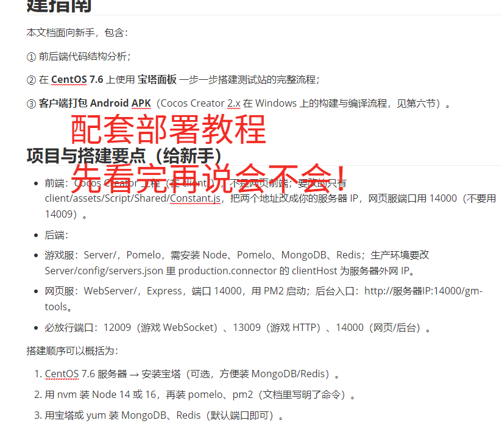

# 区块链数字交易所 合约交易所 bizzan币严

### Nodejs 开发的全套棋牌源码，后端使用nodejs开发支持在（windows、linux、macos）上搭建服务器端。客户端使用CocosCreator，支持编译发布H5网页客户端、（android/ios)app客户端。带有13款子游戏，控制方式为每款游戏都有单独的库存控制、代理及推广系统系统非常完整，且代码结构非常清晰。




## 一、项目概述

本项目是一个基于 **Node.js + Pomelo** 的棋牌游戏平台，包含 **客户端（Cocos Creator）** 与 **服务端（Pomelo 多服架构）**。主要功能包括：账号与大厅、多种棋牌/博彩游戏、房间匹配与房卡、充值提现、保险柜、佣金与代理、排行榜、邮件与公告等。

### 1.1 技术栈

| 端     | 技术                                                      |
| ------ | --------------------------------------------------------- |
| 客户端 | Cocos Creator、Pomelo 客户端                              |
| 服务端 | Pomelo（connector / hall / game / center / robot / http） |
| 存储   | MongoDB、Redis                                            |
| 通信   | WebSocket（Pomelo）、HTTP（账号/工具/充值等）             |

### 1.2 服务端地址配置（客户端 Constant.js）

- **游戏服 HTTP**：`Constant.gameServerAddress`（默认 `http://192.168.0.107:13009`）
- **Web 服**：`Constant.webServerAddress`（默认 `http://192.168.0.107:14009`）
- 图片服务器：`Constant.imgServerAddress`

---

## 二、游戏种类一览

服务端在 `Server/app/constant/enumeration.js` 中定义游戏类型枚举，配置在 `Server/config/gameTypes.json`。下表为**所有游戏种类**及对应 `kind`、说明。

| 枚举名 | kind | 中文名   | 说明                                    |
| ------ | ---- | -------- | --------------------------------------- |
| ZJH    | 1    | 扎金花   | 匹配/多档位，2–5 人                     |
| NN     | 10   | 牛牛     | 匹配/多档位，2–5 人                     |
| BRNN   | 11   | 百人牛牛 | 百人场                                  |
| SSS    | 20   | 十三水   | 匹配/多档位，2–4 人                     |
| TTZ    | 30   | 推筒子   | 百人场                                  |
| HHDZ   | 40   | 红黑大战 | 百人场                                  |
| BJL    | 50   | 百家乐   | 百人场                                  |
| LHD    | 60   | 龙虎斗   | 百人场                                  |
| FISH   | 70   | 捕鱼     | 多档位，0–4 人                          |
| DDZ    | 80   | 斗地主   | 匹配/多档位，3 人                       |
| BJ     | 90   | 21点     | 1–3 人                                  |
| DZ     | 100  | 德州扑克 | 匹配/多档位，2–9 人，支持多级盲注与带入 |
| PDK    | 110  | 跑得快   | 匹配/多档位，3 人                       |

### 2.1 游戏类型配置要点（gameTypes.json）

- **kind**：对应上表游戏种类。
- **level**：档位等级（不同底分、准入金币）。
- **matchRoom**：是否为匹配制（1 为匹配）。
- **hundred**：是否为百人场（1 为是）。
- **minPlayerCount / maxPlayerCount**：人数范围。
- **baseScore / goldLowerLimit / goldUpper**：底分与金币上下限。
- 德州扑克另有 **parameters**：如 `blindBetCount`、`preBetCount`、`maxTake` 等。

---

## 三、API 文档

接口分为两类：**HTTP 接口**（游戏服/Web 服）与 **Pomelo 路由**（大厅/游戏服等）。客户端封装见 `client/assets/Script/API/`（HttpAPI、AccountAPI、HallAPI、RoomAPI、Api.js）。

---

### 3.1 HTTP 接口

**基础地址**：  

- 账号/短信/图形验证码等：游戏服 `gameServerAddress`（如 `http://192.168.0.107:13009`）  
- 部分工具接口可能挂在 Web 服，以实际部署为准。

#### 3.1.1 账号相关（accountRoute.js）

| 方法 | 路径                    | 说明         | 请求体示例                                                   |
| ---- | ----------------------- | ------------ | ------------------------------------------------------------ |
| POST | `/register`             | 注册         | `account`, `password`, `loginPlatform`, `spreaderID?`, `smsCode?`（手机注册时） |
| POST | `/login`                | 登录         | `account`, `password`, `loginPlatform`                       |
| POST | `/resetPasswordByPhone` | 手机重置密码 | `account`, `newPassword`, `smsCode`                          |

- **loginPlatform**：1=账号 2=微信 3=手机。
- 返回：`{ code, msg? }`，登录成功时 `msg` 含 connector 分配信息。

#### 3.1.2 工具与验证（utilsRoute.js）

| 方法 | 路径                   | 说明           | 请求/参数                          |
| ---- | ---------------------- | -------------- | ---------------------------------- |
| GET  | `/httpGet`             | 转发 GET       | 查询参数 `url=...`                 |
| POST | `/httpPost`            | 转发 POST      | 查询参数 `url=...`，body：`params` |
| GET  | `/getQRCodeImgWithUrl` | 推广二维码图片 | 查询 `uid`                         |
| POST | `/getSMSCode`          | 发送短信验证码 | `phoneNumber`                      |
| GET  | `/getImgCode`          | 图形验证码     | 查询 `uniqueID`                    |

#### 3.1.3 Web 服/管理（webServerRoute.js）

| 方法 | 路径                        | 说明                 | 请求体/权限                                  |
| ---- | --------------------------- | -------------------- | -------------------------------------------- |
| POST | `/updateUserDataNotify`     | 通知在线用户数据更新 | `uid`, `updateKeys[]`                        |
| POST | `/reloadParameterNotify`    | 通知各服重载参数     | -                                            |
| POST | `/sendSystemBroadcast`      | 发送系统广播         | `content`                                    |
| POST | `/getGameControllerData`    | 获取游戏控制数据     | `permission`, `kind`（需 GAME_CONTROL 权限） |
| POST | `/updateGameControllerData` | 更新游戏控制数据     | `permission`, `kind`, `data`                 |
| POST | `/modifyInventoryValue`     | 修改库存值           | `permission`, `kind`, `uid`, `count`         |

#### 3.1.4 充值回调（rechargeRoute.js）

| 方法 | 路径        | 说明                                                      |
| ---- | ----------- | --------------------------------------------------------- |
| POST | `/anxenPay` | 安迅通支付回调，body 含平台订单号等，内部校验后写充值记录 |

---

### 3.2 Pomelo 路由（RPC / Notify）

客户端通过 `Global.NetworkManager.send(router, requestData, cbRouter, cbFail)` 或 `notify` 调用；服务端为 Pomelo handler。  
路由格式：`服务器类型. handler 名. 方法名`（如 `hall.userHandler.xxx`）。

#### 3.2.1 连接与大厅入口（connector）

| 路由                           | 说明                | 请求参数            | 返回                                                         |
| ------------------------------ | ------------------- | ------------------- | ------------------------------------------------------------ |
| `connector.entryHandler.entry` | 携带 token 进入大厅 | `token`, `userInfo` | `code`, `msg: { userInfo, publicParameter, gameTypes, agentProfit }` |

- 登录成功后用返回的 connector 信息建连，再发 `entry` 获取用户信息与游戏列表。

#### 3.2.2 大厅 - 用户（hall.userHandler）

| 路由                                       | 说明                     | 请求参数                                            |
| ------------------------------------------ | ------------------------ | --------------------------------------------------- |
| `hall.userHandler.setCoins`                | 设置金币（如后台或调试） | `gold`                                              |
| `hall.userHandler.searchUserData`          | 搜索用户数据             | `uid`                                               |
| `hall.userHandler.updateNickname`          | 修改昵称                 | `nickname`                                          |
| `hall.userHandler.updateAvatar`            | 修改头像                 | `avatar`                                            |
| `hall.userHandler.bindPhone`               | 绑定手机                 | `phone`, `verificationCode`, `imgCodeInfo?`         |
| `hall.userHandler.updateBankCardInfo`      | 更新银行卡信息           | `bankCardInfo: { cardNumber, bankName, ownerName }` |
| `hall.userHandler.updateAliPayInfoRequest` | 更新支付宝信息           | `aliPayInfo: { aliPayAccount, ownerName }`          |
| `hall.userHandler.safeBoxOperation`        | 保险柜存取               | `count`（正存负取）, `safePassword`（取时必填）     |
| `hall.userHandler.updateLoginPassword`     | 修改登录密码             | `oldPassword`, `newPassword`                        |
| `hall.userHandler.updateSafePassword`      | 修改保险柜密码           | `oldPassword`, `newPassword`                        |

#### 3.2.3 大厅 - 货币与提现（hall.currencyHandler）

| 路由                                        | 说明     | 请求参数                                         |
| ------------------------------------------- | -------- | ------------------------------------------------ |
| `hall.currencyHandler.withdrawCashRequest`  | 提款申请 | `count`, `withdrawCashType`（1 支付宝 2 银行卡） |
| `hall.currencyHandler.extractionCommission` | 提取佣金 | 无                                               |

#### 3.2.4 大厅 - 游戏与房间（hall.gameHandler）

| 路由                                        | 说明                   | 请求参数                 |
| ------------------------------------------- | ---------------------- | ------------------------ |
| `hall.gameHandler.createRoom`               | 创建房间（房卡等）     | `gameRule`, `gameTypeID` |
| `hall.gameHandler.joinRoom`                 | 加入房间               | `roomId`                 |
| `hall.gameHandler.exitRoom`                 | 退出房间               | 无                       |
| `hall.gameHandler.matchRoom`                | 匹配房间               | `gameTypeID`             |
| `hall.gameHandler.stopMatchRoom`            | 取消匹配               | 无                       |
| `hall.gameHandler.getAllRoomGameDataByKind` | 按种类获取所有房间数据 | `kindID`                 |
| `hall.gameHandler.getRoomGameDataByRoomID`  | 按房间 ID 获取房间数据 | `roomID`                 |

#### 3.2.5 大厅 - 记录（hall.recordHandler）

| 路由                                             | 说明         | 请求参数                            |
| ------------------------------------------------ | ------------ | ----------------------------------- |
| `hall.recordHandler.getRecordData`               | 获取记录     | `recordType`, `startIndex`, `count` |
| `hall.recordHandler.getGameRecordDataRequest`    | 获取游戏记录 | `matchData`, `sortData`             |
| `hall.recordHandler.getDirectlyMemberRecordData` | 直属成员记录 | `startIndex`, `count`               |
| `hall.recordHandler.getAgentMemberRecordData`    | 代理成员记录 | `startIndex`, `count`               |

**recordType**（枚举 recordType）：充值、提现、游戏、登录、提取佣金、游戏抽水、库存抽取、管理员赠送等。

#### 3.2.6 大厅 - 排行榜（center.rankHandler）

| 路由                                                 | 说明             | 请求参数              |
| ---------------------------------------------------- | ---------------- | --------------------- |
| `center.rankHandler.getTodayWinGoldCountRankRequest` | 今日赢金币排行榜 | `startIndex`, `count` |

#### 3.2.7 大厅 - 充值与邮件（hall）

| 路由                                | 说明         | 请求参数                                     |
| ----------------------------------- | ------------ | -------------------------------------------- |
| `hall.rechargeHandler.purchaseItem` | 购买充值商品 | `itemID`, `rechargePlatform`, `rechargeInfo` |
| `hall.emailHandler.readEmail`       | 读邮件       | `emailID`                                    |

#### 3.2.8 游戏服 - 房间内消息（game.gameHandler）

| 路由                                 | 说明                               | 请求参数              |
| ------------------------------------ | ---------------------------------- | --------------------- |
| `game.gameHandler.roomMessageNotify` | 房间内通知（如聊天、准备、离开等） | 由各游戏/房间协议约定 |
| `game.gameHandler.gameMessageNotify` | 游戏内通知（出牌、下注等）         | 由各游戏协议约定      |

- 以上为 **notify**，无返回；具体消息格式见各游戏 Proto（如 RoomProto、各游戏 XXXProto）。

#### 3.2.9 房间通用协议号（RoomProto）

客户端 `RoomProto.js` 中定义了房间相关协议号（如准备、进出房、聊天、解散、重连、申请解散等），用于 `roomMessageNotify` / `gameMessageNotify` 的 `type` 与 `data` 结构。例如：

- 301/401 准备、303/403/404 离开、307/407 聊天、405 解散、312/412 重连、313/413 申请解散、318/418 场景信息、319/419 在线用户等。

具体各游戏的请求/推送字段需结合服务端对应 gameComponent 下 Proto 与 gameFrame 查看。

---

### 3.3 客户端 API 模块汇总

| 模块       | 文件            | 用途                                               |
| ---------- | --------------- | -------------------------------------------------- |
| Api        | `Api.js`        | 统一入口：hall / account / room / http / roomProto |
| AccountAPI | `AccountAPI.js` | 登录、注册、重置密码（含 HTTP 与部分 Pomelo）      |
| HttpAPI    | `HttpAPI.js`    | 如 getPhoneCode（/getSMSCode）                     |
| HallAPI    | `HallAPI.js`    | 大厅用户、货币、房间、记录、排行榜、充值、邮件等   |
| RoomAPI    | `RoomAPI.js`    | roomMessageNotify、gameMessageNotify               |
| RoomProto  | `RoomProto.js`  | 房间协议常量与构造方法                             |

HTTP 请求通过 `Global.NetworkLogic.gameServerHttpRequest(route, method, requestData, cbSuccess, cbFail)` 发送到 `Constant.gameServerAddress`。

---

## 四、项目结构简览

```
game-nodejs/
├── client/                    # Cocos Creator 客户端
│   ├── assets/
│   │   ├── Script/
│   │   │   ├── API/           # 接口封装
│   │   │   ├── Game/          # 各游戏逻辑（ZJH/NN/SSS/TTZ/HHDZ/BJL/LHD/Fish/DDZ/BJ/DZ/PDK 等）
│   │   │   ├── UI/            # 大厅、登录、银行、排行榜、公告等
│   │   │   ├── Shared/        # 常量、网络、场景初始化
│   │   │   └── Models/
│   │   └── resources/         # 预制体与资源（按游戏/功能分目录）
│   └── settings/
├── Server/                    # Pomelo 服务端
│   ├── app/
│   │   ├── constant/          # 枚举、全局常量、错误码
│   │   ├── config/            # gameTypes.json 等
│   │   ├── servers/
│   │   │   ├── connector/     # 连接与 entry
│   │   │   ├── hall/          # 大厅 handler（user/game/record/currency/recharge/email/rank）
│   │   │   ├── game/         # 房间与游戏消息
│   │   │   ├── center/       # 中心服（如排行榜）
│   │   │   ├── robot/        # 机器人与控制
│   │   │   └── http/         # HTTP 路由（account/utils/webServer/recharge）
│   │   ├── gameComponent/    # 各游戏逻辑（与枚举 gameType 对应）
│   │   ├── dao/              # 数据访问
│   │   └── services/
│   └── ...
└── 项目分析与API文档.md       # 本文档
```

---

## 五、附录：游戏种类与 kind 对照

| kind | 游戏     |
| ---- | -------- |
| 1    | 扎金花   |
| 10   | 牛牛     |
| 11   | 百人牛牛 |
| 20   | 十三水   |
| 30   | 推筒子   |
| 40   | 红黑大战 |
| 50   | 百家乐   |
| 60   | 龙虎斗   |
| 70   | 捕鱼     |
| 80   | 斗地主   |
| 90   | 21点     |
| 100  | 德州扑克 |
| 110  | 跑得快   |


# 联系我们

1、Whatsapp: 

***‪+44 7936 866117‬***


2、Telegram

https://t.me/usdtvps666

